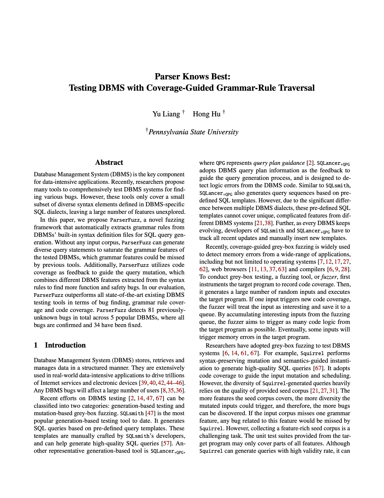
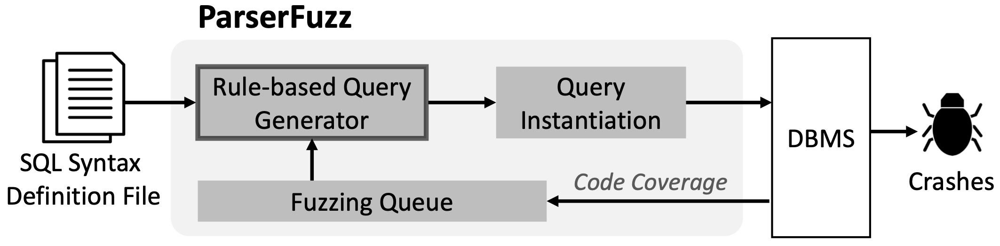

# Parser Knows Best: Testing DBMS with Coverage-Guided Grammar-Rule Traversal

<a href="Paper/paper.pdf"></a>

Version: 1.0\
Update: Mar 6th, 2025\
Paper: Parser Knows Best: Testing DBMS with Coverage-Guided Grammar-Rule Traversal

Currently supported DBMS:
1. SQLite3
2. MySQL
3. MariaDB
4. CockroachDB
5. TiDB

<br/><br/>
## ParserFuzz Overview

`ParserFuzz` extracts the DBMSs built-in grammar definition and generates testing SQL queries based on the extracted grammar rules. It ensures diverse SQL query generation by thoroughly exploring the grammar space, while maintaining a high query correctness rate by strictly following the built-in grammar rules. 

The overview of `ParserFuzz` is illustrated by the diagram below.

<p align="center">

</p>

<br/><br/>
## Installation & Run

The Installation and Run instructions can be found in this [link](docs/install_n_run_steps.md).

<br/><br/>
## Authors

- Yu Liang yuliang@psu.edu
- Hong Hu honghu@psu.edu

<br/><br/>
## Publications

```bib
Detecting Logical Bugs of DBMS with Coverage-based Guidance

@inproceedings {liang:parserfuzz,
	title = {{Parser Knows Best: Testing DBMS with Coverage-Guided Grammar-Rule Traversal}},
	copyright = {All rights reserved},
	url = {http://arxiv.org/abs/2503.03893},
	doi = {10.48550/arXiv.2503.03893},
	language = {en},
	publisher = {arXiv},
	author = {Liang, Yu and Hu, Hong},
	month = mar,
	year = {2025},
}
```

